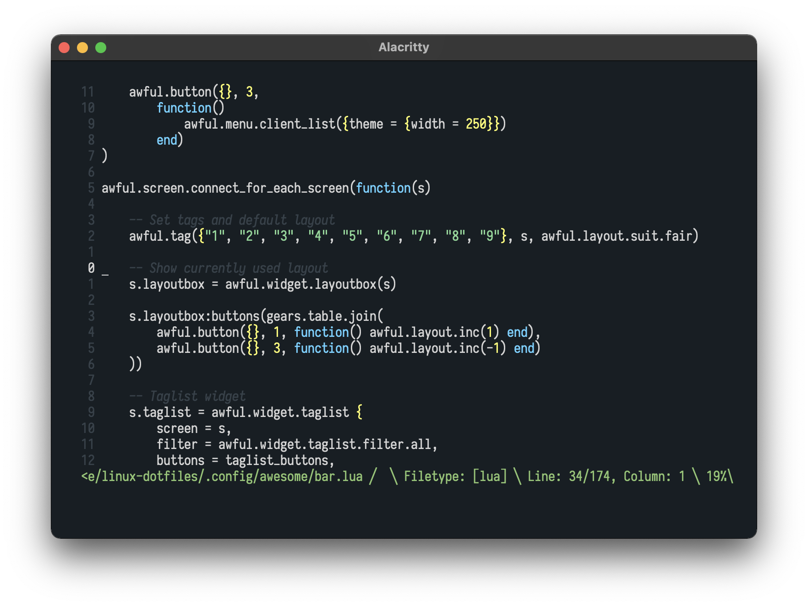

# Quiet theme for Vim


Huge thanks to [FrenzyExists](https://github.com/FrenzyExists) for the banner!

## Getting Started

### Instalation

* vim-plug
```vim]
Plug 'QuietTheme/Vim'
```

* packer
```lua
use 'QuietTheme/Vim'
```

### Screenshot


